 

### We help startups and enterprises design, build, automate and scale high-performance digital products.

 

 

## ✦ What we build

<table>
  <tr>
    <td width="25%" valign="top">
      <h4>🌐 Web Development</h4>
      Product web apps and content platforms, typed end to end and tuned on real field data.
    </td>
    <td width="25%" valign="top">
      <h4>📱 Mobile Apps</h4>
      One React Native or Flutter codebase for iOS and Android, shipped through store review.
    </td>
    <td width="25%" valign="top">
      <h4>🎨 UI/UX Design</h4>
      Research, flows and design systems, handed over in Figma <i>and</i> in code.
    </td>
    <td width="25%" valign="top">
      <h4>🤖 AI &amp; Automation</h4>
      LLM features, assistants and workflow automation that earn their place in the product.
    </td>
  </tr>
  <tr>
    <td width="25%" valign="top">
      <h4>☁️ DevOps &amp; Cloud</h4>
      Infrastructure as code, CI/CD and observability that keep releases boring.
    </td>
    <td width="25%" valign="top">
      <h4>🚀 SaaS Products</h4>
      Multi-tenant platforms with auth, billing and admin, from first idea to launch.
    </td>
    <td width="25%" valign="top">
      <h4>🧪 QA &amp; Testing</h4>
      Automated end-to-end, API and device testing built into the delivery pipeline.
    </td>
    <td width="25%" valign="top">
      <h4>👥 Dedicated Teams</h4>
      Engineers, designers and QA who plug into your roadmap and ship alongside you.
    </td>
  </tr>
</table>

## ✦ How we work

<table>
  <tr>
    <td width="33%" valign="top">
      <h4>Typed end to end</h4>
      TypeScript from the database schema to the rendered prop, so refactors stay safe.
    </td>
    <td width="33%" valign="top">
      <h4>Measured, not assumed</h4>
      Real-session data drives performance and product decisions, not lab scores.
    </td>
    <td width="33%" valign="top">
      <h4>Yours to run</h4>
      Documented, conventionally structured code your team can pick up on day one.
    </td>
  </tr>
</table>

## ✦ Built by Nexaturn

<table>
  <tr>
    <td width="120" align="center" valign="middle">
      <h1>🏏</h1>
    </td>
    <td valign="top">
      <h3>Kheliyo</h3>
      Book sports courts and find players across Pakistan. Search venues, pick a court and a slot, book in seconds and pay at the venue. Host or join pickup games, and help venue owners fill their empty hours.
        
      
      
      
      
    </td>
  </tr>
</table>

## ✦ Our stack

  
   
  

 

**Have an idea worth building?** &nbsp;→&nbsp; [hello@nexaturn.com](mailto:hello@nexaturn.com)

Ideas → Products → A brighter tomorrow

